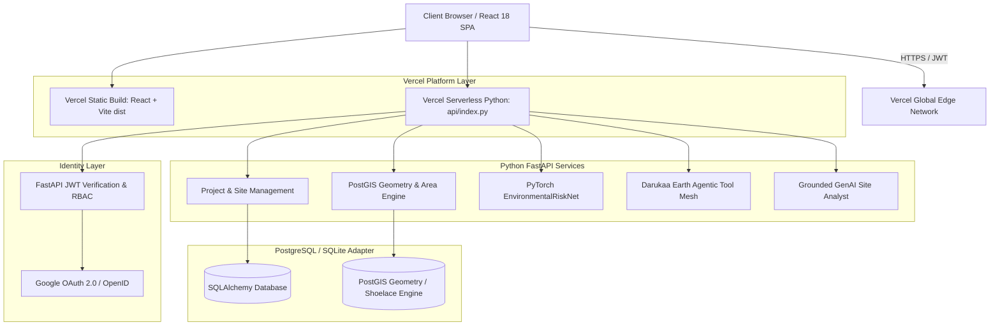
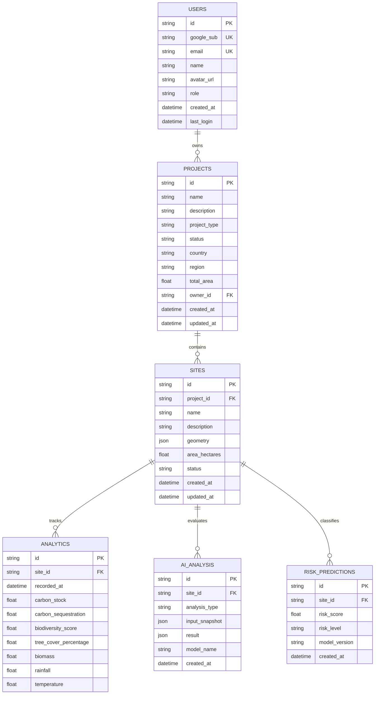

# DARUKAA.EARTH — AI-Powered Geospatial Carbon & Biodiversity Platform


**Darukaa.Earth** is a production-grade geospatial platform designed for managing, auditing, and forecasting carbon and biodiversity conservation projects. It combines PostGIS spatial indexing, Mapbox GL vector drawing, PyTorch neural network risk prediction, and grounded Agentic AI tools into a single Earth-tech SaaS platform.

---

## 🚀 Quick Vercel Deployment Guide

Darukaa.Earth is pre-configured for instant deployment to Vercel using Vercel Serverless Python Functions (`@vercel/python`) and Static React Build (`@vercel/static-build`).

### Option A: One-Click Vercel CLI Deployment

1. **Install Vercel CLI**:
   ```bash
   npm install -g vercel
   ```

2. **Deploy directly from project root**:
   ```bash
   vercel
   ```

3. **Deploy to Production**:
   ```bash
   vercel --prod
   ```

---

### Option B: Deploying via Vercel Web Dashboard (GitHub Integration)

1. Push your repository to **GitHub**.
2. Log into **[Vercel Dashboard](https://vercel.com/dashboard)**.
3. Click **"Add New Project"** $\rightarrow$ Select your `darukaa-earth` repository.
4. **Build Settings**:
   - **Framework Preset**: Vite
   - **Build Command**: `npm run build`
   - **Output Directory**: `dist`
5. **Environment Variables**: Set environment variables securely in your Vercel Project Settings panel (`Settings -> Environment Variables`).

---

## 📐 System Architecture



---

## 🗄️ Database Entity Relationship Diagram



---

## 🛠️ Technology Stack

### Frontend
- **Framework**: React 18, Vite, TypeScript
- **Styling**: Tailwind CSS, Lucide Icons
- **Geospatial & Maps**: Mapbox GL JS (`v3.2.0`), Mapbox GL Draw (`@mapbox/mapbox-gl-draw`)
- **Data Visualization**: Chart.js (`react-chartjs-2`)
- **HTTP Client**: Axios with JWT Bearer auto-injection interceptor
- **Forms & Validation**: React Hook Form, Zod

### Backend
- **Framework**: Python FastAPI
- **Vercel Serverless Handler**: `api/index.py`
- **Database ORM**: SQLAlchemy 2.0, GeoAlchemy2, SQLite / PostgreSQL PostGIS compatibility adapter
- **Security**: Google OAuth 2.0 OpenID Token Verification, HS256 JWT, RBAC (`ADMIN`, `ANALYST`)
- **Spatial Geometry Engine**: PostGIS `ST_Area`, `ST_Centroid`, `ST_AsGeoJSON`, Shoelace spherical polygon area fallback
- **Validation**: Pydantic v2 schemas

### Deep Learning & AI
- **Deep Learning**: PyTorch Neural Network (`EnvironmentalRiskNet`) taking 7 normalized ecological features $\rightarrow$ Composite Risk Score (0.0 to 1.0) & Risk Level (`Low`, `Moderate`, `High`)
- **Agentic AI**: `DarukaaAgent` with controlled backend application tools (`get_projects`, `get_sites`, `get_site_analytics`, `compare_sites`, `get_carbon_trend`, `get_biodiversity_trend`)
- **GenAI Analyst**: Grounded LLM site auditor enforcing dataset non-fabrication rules

---

## 💻 Local Development Setup

### Prerequisites
- Python 3.10+
- Node.js v18+ / npm

### Step-by-Step

1. **Clone repository**:
   ```bash
   git clone https://github.com/Mj2004-byte/Darukaa.earth.git
   cd daruka
   ```

2. **Backend Setup**:
   ```bash
   python -m pip install -r requirements.txt
   python -m backend.db.seed_data
   python -m backend.ml.train
   ```

3. **Run Live Backend Server**:
   ```bash
   python -m uvicorn backend.main:app --reload --port 8000
   ```

4. **Run Live Frontend Dev Server**:
   ```bash
   npm install
   npm run dev
   ```

5. **Access Application**:
   - Web App (Vite Dev): `http://localhost:3000`
   - Full App (FastAPI Production Bundle): `http://localhost:8000`
   - API Docs: `http://localhost:8000/api/docs`

---

## 🧪 Testing & Code Quality

```bash
# Run backend pytest suite
python -m pytest

# Run Python code formatting & linting
ruff check backend/
black backend/

# Run Frontend Typecheck & Build
npm run typecheck
npm run build
```

---

## 🛡️ Role Architecture (ADMIN vs ANALYST)

- **ADMIN**: Can create/edit/delete projects, draw land polygons via Mapbox GL Draw, run AI analysis, run PyTorch risk models, and generate audit reports.
- **ANALYST**: Read-only access to projects and sites, full access to AI analysis, AI Chat Agent, PyTorch risk model, site comparison, and report export.

---

## 📄 License & Notice

Demonstration project created for hiring hackathon evaluation. Built using ground-truth dataset rules, PyTorch deep learning models, Mapbox GL, PostGIS spatial algorithms, and Vercel serverless functions.
